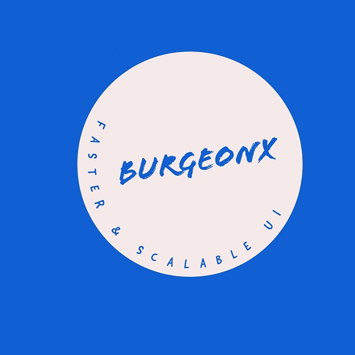

# [BurgeonX-UI](https://burgeonx.netlify.app/components)

 

# About

### BurgeonX-UI is a light and scalable user-interface where you will get all ready-made pieces to build your own website ready. You only have to put those pieces together and you got a nice-designed website ready. 
###

# [Documentation](https://burgeonx.netlify.app/components/html/component)

## Demo

#### https://burgeonx.netlify.app/

## Get Started

#### check out whole documentation at [BurgeonX-UI](https://burgeonx.netlify.app/)

#### On Features section, you can click on various components to go to specific docs.

## Features

#### [Avatar](https://burgeonx.netlify.app/components/html/component#avatar)

#### [Alert](https://burgeonx.netlify.app/components/html/component#alert)

#### [Badge](https://burgeonx.netlify.app/components/html/component#badge)

#### [Button](https://burgeonx.netlify.app/components/html/component#button)

#### [Card](https://burgeonx.netlify.app/components/html/component#card)

#### [Image](https://burgeonx.netlify.app/components/html/component#image)

#### [input](https://burgeonx.netlify.app/components/html/component#input)

#### [Text-utilities](https://burgeonx.netlify.app/components/html/component#text-utillities)

#### [List](https://burgeonx.netlify.app/components/html/component#list)

#### [Navigation](https://burgeonx.netlify.app/components/html/component#navigation)

####

# Installation

## By Importing css & JSS files

#### copy this code inside your head tag of html file.

### 
    <link rel="stylesheet" href="https://burgeonx.netlify.app/components/CSS/component.css">

###

# Author

## - [@anurag-kkumarr](https://github.com/anurag-kkumarr)

